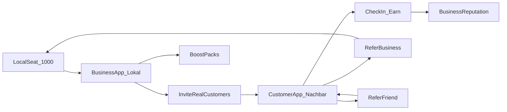

# Go-to-market: Aura Local (first 1000 local businesses)

Aura Local is the German phone-first surface of Aura OS for service shops — Friseur, Beauty, Gastro, Handwerk, Immobilien — that already have a homepage and real customers, but no honest system to turn visits into reputation and repeat traffic.

Live landing: [aibusiness.fun/lokal](https://aibusiness.fun/lokal) · Free audit: [/lokal/audit](https://aibusiness.fun/lokal/audit) · English funnel: [/for/local](https://aibusiness.fun/for/local).

## Aura Reputation funnel (first 10 paying shops)

**Do not sell “AI OS.” Sell outcomes.**

```text
LOCAL BUSINESS
      ↓
FREE REPUTATION AUDIT  (/lokal/audit)
      ↓
AURA REPUTATION        (€49 / month · Stripe)
      ↓
STERNE + GÄSTE         (invite real customers)
      ↓
later: Customer Engine / Full Aura
```

| SKU | Price | Unlock |
|---|---|---|
| Aura Reputation | **€49/mo** (`STRIPE_PRICE_AURA_REPUTATION`, plan `aura_reputation`) | `local_seat_paid_at` + subscription row |
| Startpaket / Bar / Crypto | €99 one-time Founding Local Seat (access only) | Shell, guests, reviews — **no** boost dump; packs upsell |
| Boost packs | one-time top-ups | only after unlock |

### Sales script (10 shops)

1. Open `/lokal/audit` with the owner (or send link).
2. Screenshot score + 3 recommendations.
3. WhatsApp/visit: “Kunden-Nachbetreuung + echte Sterne — 49 €/Monat, keine Fake-Reviews.”
4. Signup `funnel=local` → paywall → subscribe or redeem cash code.
5. Onboard: paste Google link → first invite.

### Success metric

Active Stripe `aura_reputation` subscriptions + redeemed seat codes with `local_seat_paid_at` set — **not** feature count.

---

## The problem we solve

Local owners juggle Instagram, Google, WhatsApp, and agency PDFs. What they actually need:

1. **Social that ships** — drafts and schedules they approve
2. **Customer list that works** — invite real patrons without spam scrapers
3. **Reputation without fakes** — systematic asks for Google feedback from people who were really there
4. **A loop that grows itself** — every happy customer and peer shop should recruit the next

Aura Local sells outcomes (visibility, reviews from real customers, new guests), not “AI credits.” Under the hood it is still Aura OS (Boost = metered AURA).

## Compliance (non-negotiable)

Google forbids **incentivizing Google reviews** (paying for stars or review content).

| Allowed | Not allowed |
|---|---|
| Invite real customers to leave feedback | Pay or tip for a Google star rating |
| Reward **check-ins**, referrals, in-app feedback, offers | Condition rewards on “leave us 5 stars” |
| Soft, optional Google CTA after a visit (no reward) | Fake reviews, scraped stars, bot accounts |

Review Boost today tracks invite clicks and redirects to the business Google URL. Rewards in the customer app attach to **visit proof and referrals**, never to Google content. See [CUSTOMER_APP.md](CUSTOMER_APP.md).

## Product wedge (what ships today)

| Piece | Path / system |
|---|---|
| German landing | `/lokal` |
| Phone shell (Heute, Social, Kunden, Bewertungen, Boost) | Local DE companies after seat |
| Local Seat | €99 · access only · Barzahlung / Stripe / crypto (USDC·ETH·BTC·SOL) |
| Cohort cap | First **1000** local seats (`local_cohort`) |
| Review Boost | Campaigns + `/r/review/$token` → Nachbar check-in primary, Google optional (no reward) |
| Public card | `/b/$slug` — **eigene Visitenkarte**: Cover-Hero, Galerie, Foto-Angebot, echte Nachbarn (Check-in + Noten), Owner-Upload unter `/business` |
| Boost packs | Sichtbarkeit / Bewertungen / Neukunden |

**Tisch pitch (Local Seat):** „Deine Seite sieht aus wie dein Laden — Galerie, Angebot, echte Nachbarn.“

Founding-seat crypto invites (`/access`, earn tiers) are a **separate** graph. Do not mix founding AURA referral stages with Lokal seat economics.

## Ecosystem flywheel



**Self-growing** means three loops reinforce each other:

1. More seated shops → more patron invites  
2. More check-ins → stronger local reputation + shop demand for Boost  
3. More B2B referrals → fill the 1000 without paid ads alone  

## Referral system (product intent)

Three linked graphs. Local graph is conceptually `local_*` — reuse patterns from founding earn (invite codes, stages, ledgers) without sharing the founding seat table.

### 1. Business → Business (B2B seat invite)

- Seated owner shares a **shop invite** link or Barzahlung path for peer niches in the same city.
- **Invitee:** joins the 1000 cohort (while seats remain), gets onboarding defaults.
- **Inviter:** Boost grant and/or Local Seat fee credit when invitee pays or redeems.

### 2. Business → Customer (B2C)

- Owner adds real customer contacts in Bewertungen / Kunden; sends `/r/review/$token` or a Nachbar deep link.
- **Customer:** welcome points when they create a patron account and complete first check-in.
- **Business:** campaign progress (invites sent / check-ins confirmed) — not “stars bought.”

### 3. Customer → Friend or Shop (C2C / C2B)

- Patron shares a friend link; reward when the friend checks in at a cohort shop.
- Patron can refer a **new business** (owner signup with ref); reward when that shop takes a Local Seat.

### Anti-abuse (design rules)

- One primary device / account per person; velocity caps on check-ins and referrals
- Check-in requires **QR at the shop**, staff confirm, or tight geofence — not a remote tap
- No reward text that mentions Google stars or review wording
- Draft invite tokens should not unlock paid flows before founder-approved send (harden over time)

## GTM phases

### Phase 0 — Seed (now → ~50 seats)

- Founder-led sales in Wien / DACH service niches
- Barzahlung codes for cash deals; Stripe when `STRIPE_PRICE_*` env is configured on the server
- Proof assets: Salon Mira–style demo, [presentation-lokal.pptx](../public/presentation-lokal.pptx), public cards

### Phase 1 — B2B viral (~50 → ~300)

- Turn on seated-owner **invite a peer shop** with Boost credit
- City pods (same niche WhatsApp / Stammtisch) rather than national ads
- Weekly “seats left of 1000” scarcity on `/lokal` (honest cohort RPC)

### Phase 2 — B2C loop (~300 → ~700)

- Ship **Aura Nachbar** (customer app) MVP: account, check-in, balance, friend invite
- Every Review Boost send becomes an on-ramp to Nachbar, not only a Google redirect
- Shops buy Boost packs when the loop is visibly filling Heute / Kunden

### Phase 3 — Density + liquidity (~700 → 1000 and beyond waitlist)

- Neighborhood density: patrons discover other cohort shops in Entdecken
- Phase rewards toward **shop perks first**, then optional USDC cash-out (limits + KYC) — see customer app doc
- Waitlist after 1000; no fake inflation of “seats left”

## Economics (honest framing)

| Actor | Pays / spends | Gets |
|---|---|---|
| Business | €99 seat (access) + optional Boost packs / €49 mo | Shell, campaigns, cohort; credits via packs |
| Customer | Time / real visits | Points → perks → later USDC (utility, not investment) |
| Aura | Ops, Stripe, chain fees | Seat + pack revenue; network effects |

Do **not** market patron balances as equity, yield, or guaranteed returns. Genesis / founding NFT language stays on the OS founding path, not Lokal patrons.

## Messaging cheat sheet

- **Business:** “Dein Laden. Social, Kunden, echte Bewertungs-Einladungen — ohne Fake-Sterne.”
- **Customer:** “Check in bei Läden die du magst. Verdiene. Bring Freunde. Optional Google — ohne Belohnung.”
- **Investor / partner:** “B2B2C flywheel capped at 1000 beachhead seats; compliance-first reputation loop.”

## Related

- [CUSTOMER_APP.md](CUSTOMER_APP.md) — onboarding, tabs, earn rules, UI
- [ARCHITECTURE.md](ARCHITECTURE.md) — system layers
- Root [README.md](../README.md) — surfaces and secrets policy
